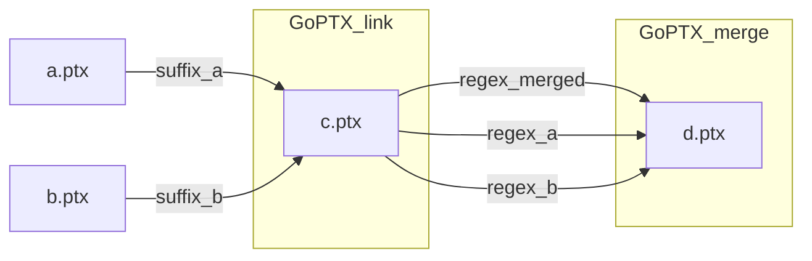

# GoPTX

GoPTX fuses two GPU concurrent kernels at PTX level to improve ILP and inter-SM resource sharing. For more details, you can see our DAC'25 paper "GoPTX: Fine-grained GPU Kernel Fusion by PTX-level Instruction Flow Weaving". The source code and docker image will come soon. More resources are available at <https://wu-kan.cn/2025/06/25/DAC25-GoPTX/>.

## Quick start

### Docker



Workflow:

1. If the two kernels are not in the same PTX file, use `GoPTX_link`. It can add suffixes to avoid name conflict.
2. `GoPTX_merge` uses regex to match the input kernels and regex to generate the name of the fused kernel.

```shell
docker run \
  --runtime=nvidia \
  --gpus "device=0" \
  --name goptx \
  -it \
  wukan0621/goptx:v0.0.1-dac25 sh
cd /GoPTX_nvcc/utils
GoPTX_link a.ptx b.ptx _sa _sb > c.ptx
GoPTX_merge c.ptx \$1_\$2_merged namea nameb > d.ptx
```

You can see how GoPTX weaves `_Z5nameaPi_sa` and `_Z5namebPf_sb`.

```txt
.version 8.5
.target sm_52
.address_size 64
.visible .entry  _Z5nameaPi_sa( .param .u64 _Z5nameaPi_param_0_sa){
 .reg .b32  %r_sa<3>;
 .reg .b64  %rd_sa<3>;
ld.param.u64 %rd_sa1,[ _Z5nameaPi_param_0_sa];
cvta.to.global.u64 %rd_sa2, %rd_sa1;
ld.global.u32 %r_sa1,[ %rd_sa2];
add.s32 %r_sa2, %r_sa1, 1;
st.global.u32[ %rd_sa2], %r_sa2;
ret;
}
.visible .entry  _Z5namebPf_sb( .param .u64 _Z5namebPf_param_0_sb){
 .reg .f32  %f_sb<3>;
 .reg .b64  %rd_sb<3>;
ld.param.u64 %rd_sb1,[ _Z5namebPf_param_0_sb];
cvta.to.global.u64 %rd_sb2, %rd_sb1;
ld.global.f32 %f_sb1,[ %rd_sb2];
add.f32 %f_sb2, %f_sb1, 0f3F800000;
st.global.f32[ %rd_sb2], %f_sb2;
ret;
}
.visible .entry  _Z5nameaPi_sa__Z5namebPf_sb_merged( .param .u64 _Z5nameaPi_param_0_saf, .param .u64 _Z5namebPf_param_0_sbs){
 .reg .b32  %r_saf<3>;
 .reg .b64  %rd_saf<3>;
 .reg .f32  %f_sbs<3>;
 .reg .b64  %rd_sbs<3>;
 $0__GoPTX:
ld.param.u64 %rd_saf1,[ _Z5nameaPi_param_0_saf];
ld.param.u64 %rd_sbs1,[ _Z5namebPf_param_0_sbs];
cvta.to.global.u64 %rd_saf2, %rd_saf1;
cvta.to.global.u64 %rd_sbs2, %rd_sbs1;
ld.global.u32 %r_saf1,[ %rd_saf2];
ld.global.f32 %f_sbs1,[ %rd_sbs2];
add.s32 %r_saf2, %r_saf1, 1;
add.f32 %f_sbs2, %f_sbs1, 0f3F800000;
st.global.u32[ %rd_saf2], %r_saf2;
st.global.f32[ %rd_sbs2], %f_sbs2;
 ret;
}
```

Get the results of the DAC'25 paper "GoPTX: Fine-grained GPU Kernel Fusion by PTX-level Instruction Flow Weaving". It requires a GPU of architecture sm_80 or sm_90 (we use A100-PCIE-40GB and have not tuned for other devices). For other architecture, you should rebuild from the source and specify your `$CUDAARCHS`. Our result is available at `/root/GoPTX_nvcc/utils/results/results.adaptive.html`.

```shell
docker run \
  --runtime=nvidia \
  --gpus "device=0" \
  --name goptx \
  wukan0621/goptx:v0.0.1-dac25
docker cp goptx:/root/GoPTX_nvcc/utils .
```

### Build from source

See [Dockerfile](./Dockerfile).

## Command line usage

```shell
GoPTX_link <a.ptx> <b.ptx> [suffix_a=""] [suffix_b=""] > c.ptx
GoPTX_merge <c.ptx> <regex_merged> <regex_a> <regex_b> [strategy=0] > d.ptx
```
